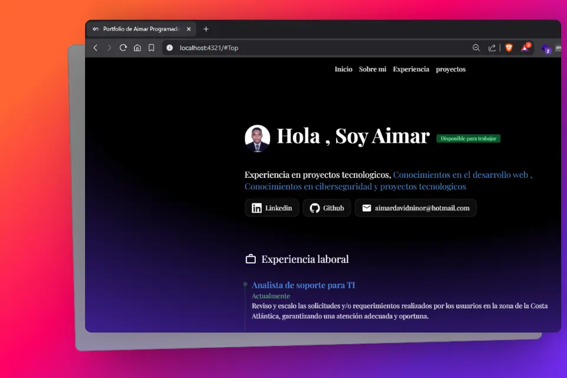

#👨🏻‍💻 Mi portafolio Web como programados Junior (En desarrollo)

  

    Un Agradecimiento especial a Midudev , brais moure y a todos los creadores de contenido sobre software ya que apesar de ser un graduado eh aprendido mucho con ustedes.
  

